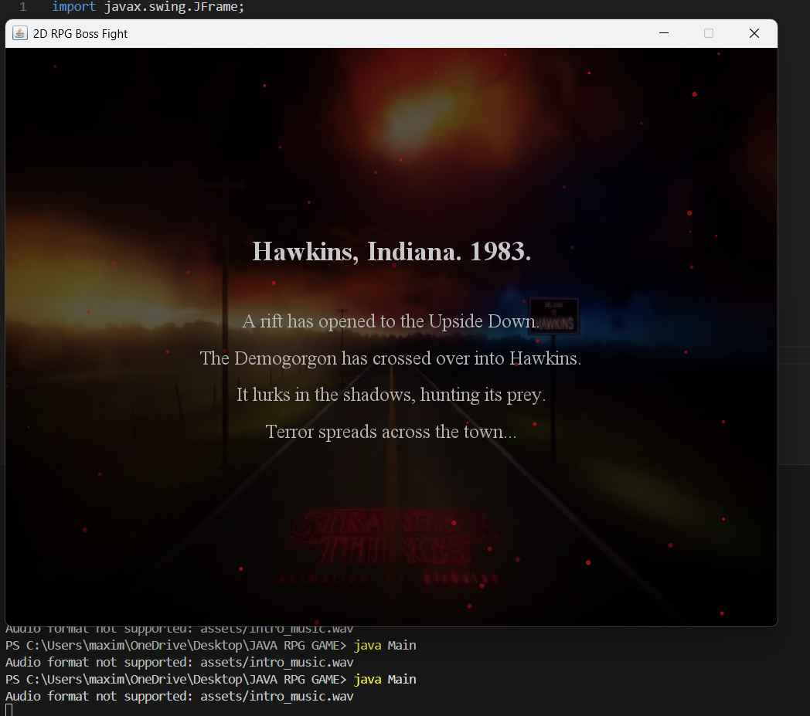
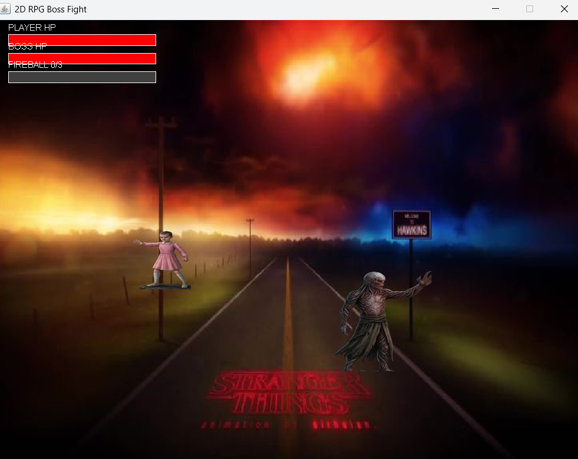

# 🎮 Stranger Things: The Demogorgon Boss Fight

⭐ Built completely from scratch using Java Swing

A 2D RPG boss fight inspired by Stranger Things.

---

## 🚀 Features

- WASD movement
- Laser attack
- Fireball attack
- Enemy AI
- Animated intro
- Health bars
- Background music

---

## 🎮 Controls

| Key | Action |
|---|---|
| W A S D | Move |
| SPACE | Laser |
| F | Fireball |

---

## 📂 Project Structure

```bash
src/
assets/
screenshots/
report/
```

---

## ▶️ Run

```bash
javac *.java
java Main
```

---

## 📸 Screenshots





---

## 📄 Report

See:
report/Final_Java_RPG_Report.pdf

---
